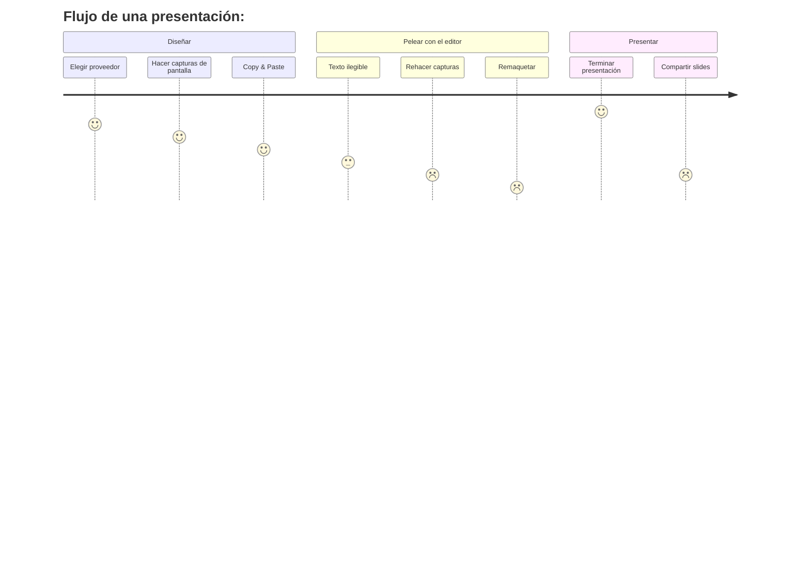

# 🤔 El Problema

Herramientas habituales:

- PowerPoint
- Google Slides
- Keynote
- OpenPoint

---
transition: fade
hideInToc: true
---

# 🤔 El Problema

Problemas con las presentaciones tradicionales:

